# Music Podcast – UI Demo

A Flutter demo app for a music and podcast platform UI.  
This is a **UI-only** project with no backend or actual podcast or music streaming functionality.

---

## 📱 Overview

The app includes design elements for:

- Podcast listings
- Music player UI
- Episode details and player controls
- User profile and library screens

---

## 🔍 Status

**Demo only** – UI focus, with no backend or streaming functionality.

---

## 📸 Screenshots

<table>
  <tr>
    <td></td>
    <td>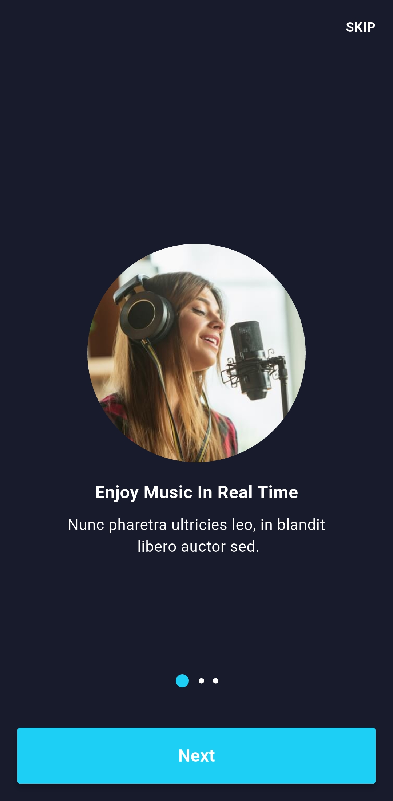</td>
    <td>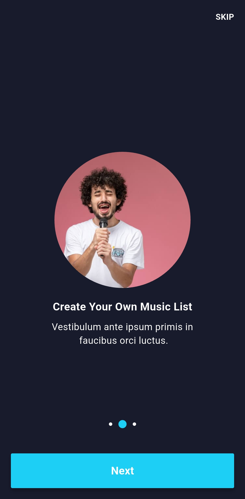</td>
    <td>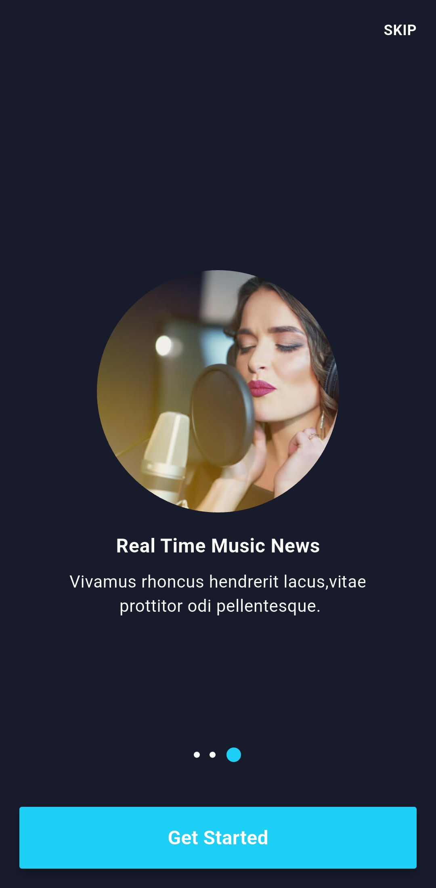</td>
  </tr>
  <tr>
    <td>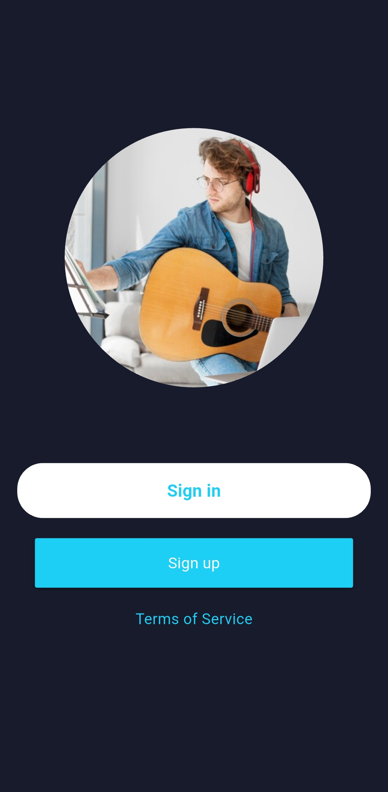</td>
    <td>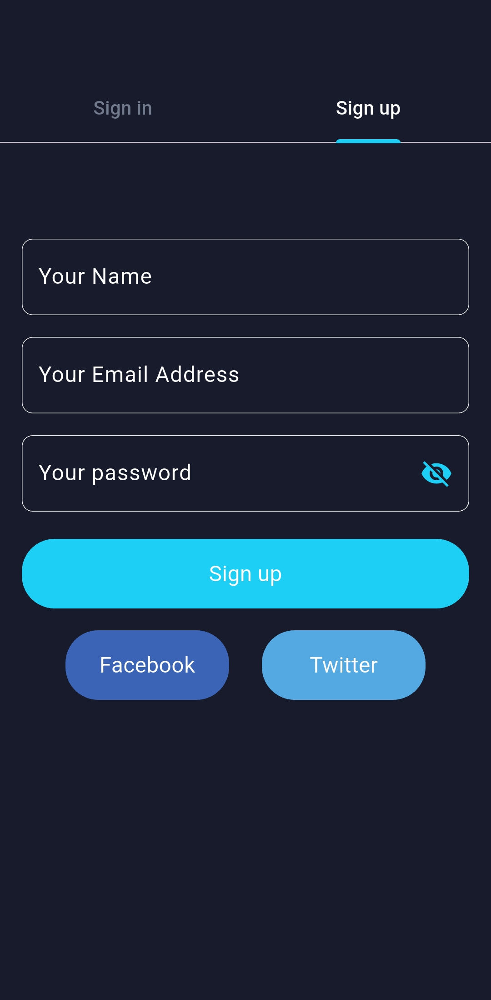</td>
    <td>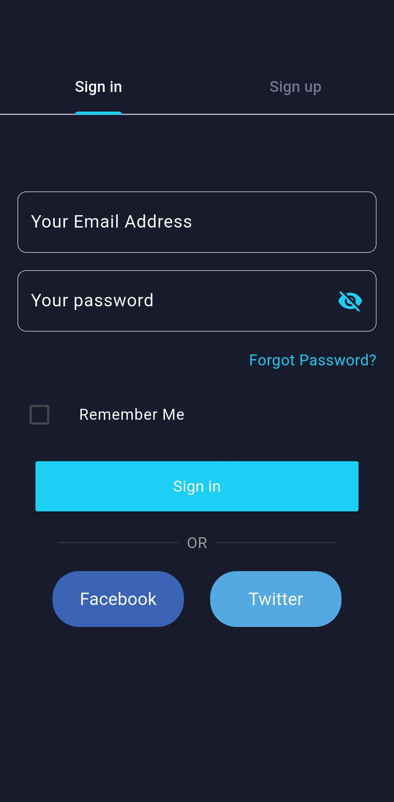</td>
    <td>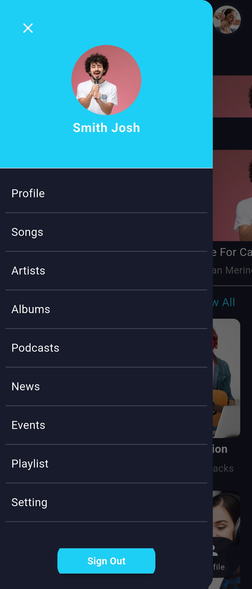</td>
  </tr>
  <tr>
    <td></td>
    <td></td>
    <td>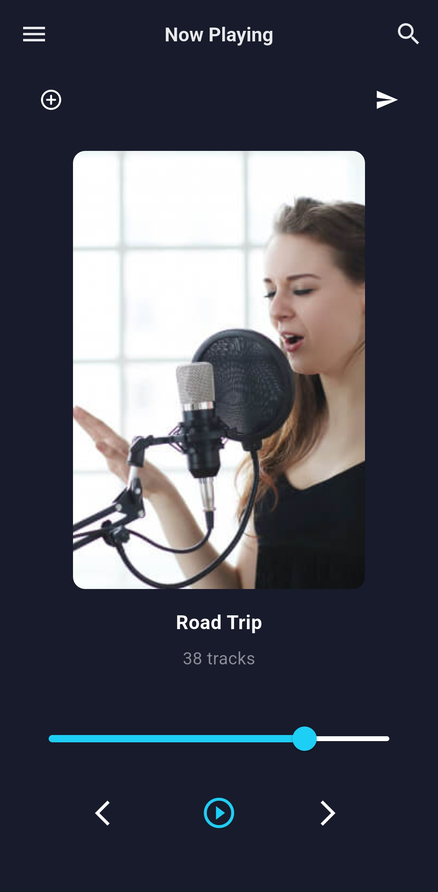</td>
    <td></td>

  </tr>
  <tr>
    <td>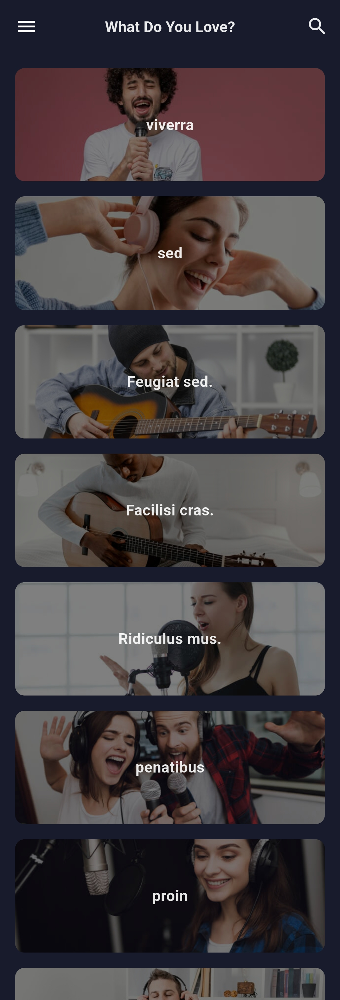</td>
    <td>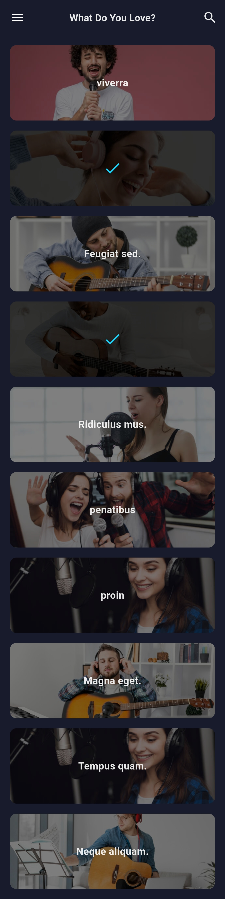</td>
    <td>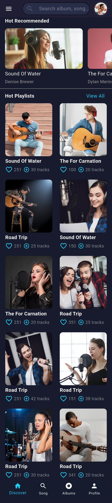</td> 
    <td></td>
  </tr>
</table>

---

## 📝 Notes

- Built entirely with Flutter
- Clean, responsive UI design
- Ideal for a podcast or music app prototype

---

## ✍️ Created by

**Mohamed Ebrahim**
